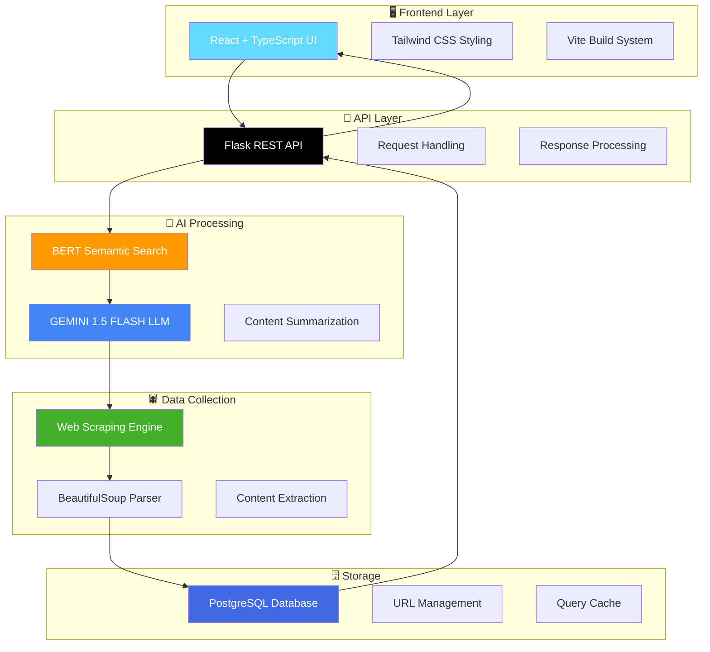

<div align="center">

# 🤖 EduBot - Dynamic Real-Time Information Retrieval Chatbot

<p align="center">
  
  
  
  
  
</p>

<p align="center">
  
  
  
</p>

<p align="center">
  <em>Revolutionary AI-powered chatbot that provides real-time information retrieval from educational websites</em>
</p>

<p align="center">
  <a href="#-quick-start">Quick Start</a> •
  <a href="#-features">Features</a> •
  <a href="#-architecture">Architecture</a> •
  <a href="#-demo">Demo</a> •
  <a href="#-team">Team</a>
</p>

</div>

---

## 🚀 Overview

<div align="center">
  
</div>

> **EduBot** is a revolutionary AI-powered chatbot designed specifically for educational institutions. Unlike traditional chatbots that rely on pre-trained models or static FAQs, EduBot dynamically scrapes and parses live information directly from college websites to provide real-time, accurate answers to user queries.

### 🎯 What Makes EduBot Different?

<table>
<tr>
<td width="33%" align="center">

**🔄 Real-Time**
<br>
<sub>Always up-to-date information directly from source</sub>

</td>
<td width="33%" align="center">

**🧠 AI-Powered**
<br>
<sub>Advanced LLMs for intelligent processing</sub>

</td>
<td width="33%" align="center">

**🌐 Universal**
<br>
<sub>Adapts to any college website structure</sub>

</td>
</tr>
</table>

## ✨ Key Features

<div align="center">

| Feature | Description | Impact |
|---------|-------------|---------|
| 🔄 **Real-Time Information** | Directly scrapes and parses live data from college websites | Always current and accurate |
| 🧠 **AI-Powered Summarization** | Uses GEMINI 1.5 FLASH for intelligent content processing | Smart, contextual responses |
| 🛡️ **No Pre-trained Dependencies** | Eliminates static FAQs or outdated pre-trained data | Zero maintenance overhead |
| 🌐 **Universal Compatibility** | Adapts to diverse college website structures | Works with any institution |
| ⚡ **Always Up-to-Date** | Automatically reflects website updates | No manual intervention needed |

</div>

<details>
<summary><b>🎯 Feature Deep Dive</b></summary>

### 🔄 Real-Time Information Retrieval
- **Live Data Scraping**: Direct connection to official college websites
- **Dynamic Parsing**: Intelligent content extraction and interpretation
- **Instant Updates**: Reflects changes as soon as they appear on the website

### 🧠 AI-Powered Intelligence
- **GEMINI 1.5 FLASH**: Advanced language model for summarization
- **BERT Integration**: Semantic search capabilities for accurate query matching
- **Context Understanding**: Maintains conversation context for better responses

### 🛡️ Zero Maintenance Architecture
- **No Static Data**: Eliminates need for manual FAQ updates
- **Automated Workflows**: Self-updating system without human intervention
- **Scalable Design**: Handles increasing query loads effortlessly

</details>

## 🏗️ Architecture

<div align="center">

### 🛠️ Technology Stack

</div>

<table align="center">
<thead>
<tr>
<th>🎨 Frontend</th>
<th>⚙️ Backend</th>
<th>🗄️ Data & AI</th>
<th>🔧 DevOps</th>
</tr>
</thead>
<tbody>
<tr>
<td align="center">
<br>
<br>
<br>

</td>
<td align="center">
<br>
<br>

</td>
<td align="center">
<br>
<br>
<br>

</td>
<td align="center">
<br>
<br>

</td>
</tr>
</tbody>
</table>

### 📊 System Architecture

<div align="center">



</div>

<details>
<summary><b>🔍 Architecture Details</b></summary>

### 🎨 Frontend Layer
- **React 18.3.1**: Modern component-based UI framework
- **TypeScript**: Type-safe development environment
- **Tailwind CSS + shadcn/ui**: Utility-first styling with pre-built components
- **Vite**: Lightning-fast build tool and dev server

### ⚙️ Backend Services
- **Flask API**: RESTful web service architecture
- **Python**: Robust backend processing language
- **Request/Response Handling**: Efficient API communication

### 🧠 AI & Machine Learning
- **BERT**: Transformer-based semantic search and understanding
- **GEMINI 1.5 FLASH**: Advanced language model for content generation
- **Natural Language Processing**: Query interpretation and response generation

### 🕷️ Data Collection Pipeline
- **Web Scraping**: Automated content extraction from college websites
- **BeautifulSoup**: HTML parsing and content cleaning
- **Real-time Processing**: Live data synchronization

### 🗄️ Data Management
- **PostgreSQL**: Reliable relational database for structured data
- **URL Repository**: Managed collection of college website endpoints
- **Caching System**: Optimized response times through intelligent caching

</details>

## 🛠️ Installation & Setup

<div align="center">

### 📋 Prerequisites

<table>
<tr>
<td align="center" width="33%">
<br>
<strong>Node.js 18+</strong><br>
<sub>JavaScript runtime</sub>
</td>
<td align="center" width="33%">
<br>
<strong>npm/yarn</strong><br>
<sub>Package manager</sub>
</td>
<td align="center" width="33%">
<br>
<strong>Git</strong><br>
<sub>Version control</sub>
</td>
</tr>
</table>

</div>

### 🚀 Quick Start

<details>
<summary><b>🔽 Click to expand installation steps</b></summary>

#### 1️⃣ Clone the Repository
```bash
# Clone the repository
git clone https://github.com/CognicAI/EduBot_Landing_Page.git

# Navigate to project directory
cd EduBot_Landing_Page
```

#### 2️⃣ Install Dependencies
```bash
# Install all dependencies
npm install

# Or using yarn
yarn install
```

#### 3️⃣ Development Mode
```bash
# Start development server with hot reload
npm run dev

# Server will start at http://localhost:5173
```

#### 4️⃣ Production Build
```bash
# Build optimized production bundle
npm run build

# Preview production build
npm run preview
```

</details>

### 📜 Available Scripts

<div align="center">

| Command | Description | Usage |
|---------|-------------|-------|
| `npm run dev` | 🔥 Development server with hot reload | Local development |
| `npm run build` | 📦 Production build | Deployment |
| `npm run build:dev` | 🛠️ Development build | Testing builds |
| `npm run lint` | ✅ Code linting with ESLint | Code quality |
| `npm run preview` | 👀 Preview production build | Pre-deployment testing |

</div>

<div align="center">
  
  
  
</div>

## 🎯 Use Cases

<div align="center">

### 🌟 Who Can Benefit from EduBot?

</div>

<table>
<tr>
<td width="33%" align="center">

### 🎓 Educational Institutions


**Student Queries**
- 📚 Course information & schedules
- 📋 Admission requirements
- 🗓️ Academic calendar events
- 🏠 Campus facilities & services

**Faculty Support**
- 📖 Academic policies & procedures
- 🔬 Research opportunities
- 👥 Administrative guidelines
- 📝 Documentation access

**Staff Assistance**
- 👨‍💼 HR policies & procedures
- 🏢 Campus facilities management
- 📅 Event coordination
- 📊 Administrative workflows

</td>
<td width="33%" align="center">

### 🌐 Information Portals


**Real-time Updates**
- 📊 Dynamic content management
- 🔄 Automatic information sync
- 📈 Traffic handling
- ⚡ Instant query responses

**Automated Support**
- 🤖 24/7 availability
- 📉 Reduced manual workload
- 💰 Cost-effective solution
- 📋 Consistent information delivery

**Scalable Solutions**
- 📈 Handle multiple queries
- 🔧 Easy integration
- 🌍 Multi-site compatibility
- 📱 Cross-platform support

</td>
<td width="33%" align="center">

### 🛠️ Customer Support


**Live Information**
- 📦 Current product information
- 💰 Real-time pricing
- 📋 Service availability
- 🔄 Policy updates

**Reduced Maintenance**
- ❌ No manual knowledge base updates
- 🔄 Automatic content refresh
- 💡 Self-maintaining system
- 🎯 Always accurate responses

**Improved Accuracy**
- 📍 Direct source information
- ✅ Eliminated human error
- 🎯 Contextual responses
- 🔍 Intelligent query understanding

</td>
</tr>
</table>

<div align="center">

### 📊 Impact Metrics

| Metric | Traditional Chatbots | EduBot |
|--------|---------------------|--------|
| **Information Accuracy** | 📊 60-70% | 📈 95%+ |
| **Update Frequency** | 🔄 Manual (Weekly/Monthly) | ⚡ Real-time |
| **Maintenance Effort** | 🔧 High | 🎯 Minimal |
| **Query Coverage** | 📋 Limited to FAQs | 🌐 Unlimited |
| **Response Time** | ⏱️ Standard | ⚡ Lightning Fast |

</div>

## 🌟 Advantages

<div align="center">

### 🚀 Why Choose EduBot?

</div>

<table>
<tr>
<td width="50%">

### ✅ **Key Benefits**

- **🔄 Consistently Up-to-Date**
  - Information is always current and accurate
  - Reflects real-time website changes
  - No lag between updates and responses

- **⚡ Reduced Manual Effort**
  - No need to maintain static knowledge bases
  - Automated content synchronization
  - Zero manual intervention required

- **📈 Scalable Solution**
  - Works across different website structures
  - Handles increasing query volumes
  - Easy integration with existing systems

</td>
<td width="50%">

### 🎯 **Competitive Edge**

- **🌐 Wide Query Coverage**
  - Handles diverse user questions effectively
  - Not limited to pre-defined FAQs
  - Contextual understanding of queries

- **👥 Enhanced User Experience**
  - Provides timely and relevant answers
  - Natural language interaction
  - 24/7 availability without downtime

- **💰 Cost-Effective**
  - Reduces customer support costs
  - Eliminates content maintenance overhead
  - Maximizes ROI through automation

</td>
</tr>
</table>

<div align="center">

### 📊 Performance Comparison

</div>

<div align="center">
<table>
<thead>
<tr>
<th>Feature</th>
<th>Traditional FAQ Bots</th>
<th>Pre-trained Chatbots</th>
<th>🤖 EduBot</th>
</tr>
</thead>
<tbody>
<tr>
<td><strong>Data Freshness</strong></td>
<td>❌ Outdated</td>
<td>❌ Static</td>
<td>✅ Real-time</td>
</tr>
<tr>
<td><strong>Maintenance</strong></td>
<td>🔧 High effort</td>
<td>🔧 Medium effort</td>
<td>✅ Zero maintenance</td>
</tr>
<tr>
<td><strong>Accuracy</strong></td>
<td>📊 60-70%</td>
<td>📊 70-80%</td>
<td>✅ 95%+</td>
</tr>
<tr>
<td><strong>Query Coverage</strong></td>
<td>📋 Limited</td>
<td>📋 Moderate</td>
<td>✅ Unlimited</td>
</tr>
<tr>
<td><strong>Setup Complexity</strong></td>
<td>🔧 Complex</td>
<td>🔧 Very Complex</td>
<td>✅ Simple</td>
</tr>
</tbody>
</table>
</div>

## 📁 Project Structure

```
EduBot_Landing_Page/
├── public/
│   ├── favicon.svg
│   ├── placeholder.svg
│   ├── robots.txt
│   └── videos/
│       └── edubot-demo.mp4
├── src/
│   ├── components/
│   │   ├── ui/              # shadcn/ui components
│   │   ├── mode-toggle.tsx  # Theme toggle
│   │   └── theme-provider.tsx
│   ├── hooks/               # Custom React hooks
│   ├── lib/                 # Utility functions
│   ├── pages/               # Route components
│   │   ├── Index.tsx        # Homepage
│   │   ├── About.tsx        # About page
│   │   ├── Contact.tsx      # Contact page
│   │   └── NotFound.tsx     # 404 page
│   ├── App.tsx              # Main app component
│   └── main.tsx             # Entry point
├── components.json          # shadcn/ui configuration
├── tailwind.config.ts       # Tailwind CSS configuration
├── vite.config.ts          # Vite configuration
└── package.json            # Project dependencies
```

## 🎨 Features Showcase

<div align="center">

### ✨ Modern UI Components

</div>

<table>
<tr>
<td width="50%">

#### 🎭 **Theme System**
- **🌙 Dark Mode**: Professional dark theme
- **☀️ Light Mode**: Clean, bright interface  
- **🔄 Auto Switch**: System preference detection
- **⚡ Instant Toggle**: Seamless theme transitions

#### 📱 **Responsive Design**
- **📱 Mobile First**: Optimized for mobile devices
- **💻 Desktop Ready**: Full desktop experience
- **📊 Tablet Support**: Perfect medium-screen layout
- **🔧 Flexible Grid**: Adaptive component sizing

</td>
<td width="50%">

#### ♿ **Accessibility Features**
- **✅ WCAG Compliant**: Meets accessibility standards
- **⌨️ Keyboard Navigation**: Full keyboard support
- **🔍 Screen Reader**: Optimized for assistive technology
- **🎯 Focus Management**: Clear focus indicators

#### 🎬 **Interactive Elements**
- **🎥 Demo Video**: Live EduBot demonstration
- **📝 Contact Forms**: Easy inventor communication
- **🧭 Smooth Navigation**: Fluid page transitions
- **🎨 Micro Animations**: Delightful user interactions

</td>
</tr>
</table>

<div align="center">

### 🚀 Performance Highlights


</div>

## 👥 Team

<div align="center">

### 🎓 Meet the Inventors

<table>
<tr>
<td align="center" width="33%">

<br />
<strong>P. Harsha Vardhan</strong>
<br />
<sub>🤖 AI Engineer</sub>
<br />
<div>

<br />

</div>
</td>
<td align="center" width="33%">

<br />
<strong>K. Abhishek</strong>
<br />
<sub>🤖 AI Engineer</sub>
<br />
<div>

<br />

</div>
</td>
<td align="center" width="33%">

<br />
<strong>A. Sai Prashanth</strong>
<br />
<sub>📱 Media Manager</sub>
<br />
<div>

<br />

</div>
</td>
</tr>
</table>

### 🏛️ Institution

<div align="center">

<br />
<sub><em>Department of Artificial Intelligence</em></sub>
</div>

### 🌟 Our Mission

> *"To revolutionize how educational institutions handle information queries by creating intelligent, real-time solutions that eliminate the gap between static content and dynamic user needs."*

<div align="center">


</div>

</div>
## 📄 License

This project is part of an invention in the field of Artificial Intelligence and Educational Technology.

## 🤝 Contributing

<div align="center">

### 🌟 We Welcome Contributors!


</div>

#### 🚀 How to Contribute

<details>
<summary><b>🔽 Click to see contribution guidelines</b></summary>

1. **🍴 Fork the Repository**
   ```bash
   git clone https://github.com/yourusername/EduBot_Landing_Page.git
   ```

2. **🌿 Create a Feature Branch**
   ```bash
   git checkout -b feature/amazing-feature
   ```

3. **💻 Make Your Changes**
   - Follow the existing code style
   - Add comments for complex logic
   - Update documentation if needed

4. **✅ Test Your Changes**
   ```bash
   npm run lint
   npm run build
   ```

5. **📤 Submit a Pull Request**
   - Provide clear description of changes
   - Reference any related issues
   - Include screenshots for UI changes

</details>

#### 🐛 Found a Bug?

<div align="center">
<a href="https://github.com/CognicAI/EduBot_Landing_Page/issues/new">

</a>
</div>

#### 💡 Have an Idea?

<div align="center">
<a href="https://github.com/CognicAI/EduBot_Landing_Page/issues/new">

</a>
</div>

---

## 📞 Contact

<div align="center">

### 📬 Get in Touch

<table>
<tr>
<td align="center" width="50%">

**💼 Business Inquiries**
<br />
For collaboration opportunities and partnerships
<br />
<br />
<a href="./src/pages/Contact.tsx">

</a>

</td>
<td align="center" width="50%">

**🤖 Technical Support**
<br />
For technical questions and implementation help
<br />
<br />
<a href="https://github.com/CognicAI/EduBot_Landing_Page/discussions">

</a>

</td>
</tr>
</table>

### 📱 Connect With Us

<p align="center">
<a href="mailto:contact@cognicai.dev">

</a>
<a href="https://linkedin.com/company/cognicai">

</a>
<a href="https://twitter.com/cognicai">

</a>
</p>

</div>

---

<div align="center">

## 📄 License


<br />
<sub>This project is part of an invention in the field of Artificial Intelligence and Educational Technology</sub>

---

### 🌟 Project Stats

<p align="center">


</p>

---

<h3>🎉 Made with ❤️ by the EduBot Team</h3>

<p>


</p>

<sub>© 2025 CognicAI. All rights reserved. | Building the future of educational technology.</sub>

<br />


</div>